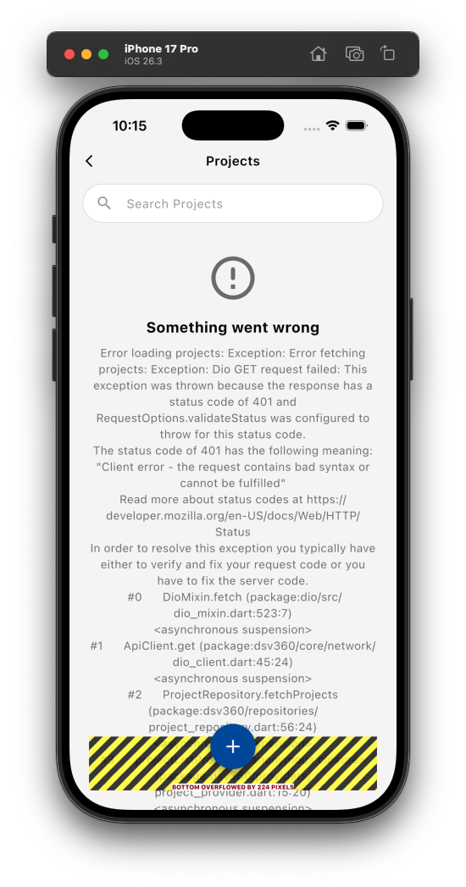

# 401 Unauthorised Error — Projects Screen (Intermittent)

> **Symptom:** After login, or during normal app use, the Projects screen (and potentially other screens) suddenly shows  
> *"Error loading projects: Exception: Error fetching projects: Exception: Dio GET request failed: status code 401"*  
> The error disappears only after a **hot restart**.

---



## What a 401 means here

The Catalyst API is returning **HTTP 401 Unauthorized**, meaning the `Authorization` header the app sent with the request was **rejected by the server** — either the token is expired, missing, or invalid.

---

## Root Cause 1 — Token is cached forever in memory and never refreshed

**File:** `lib/core/constants/token_manager.dart`  
**Class:** `TokenManager`  
**Field:** `String? _accessToken`

```dart
Future<String?> getToken() async {
  if (_accessToken != null) {   // ← returns stale token immediately, no expiry check
    return _accessToken;
  }
  ...
}
```

- The first time `getToken()` is called it fetches a fresh token from the Catalyst SDK and stores it in `_accessToken`.
- **Every subsequent call returns the same cached string directly**, without ever checking whether it has expired.
- `clearToken()` sets `_accessToken = null`, but **nothing in the app calls `clearToken()` automatically** — it is never triggered on a 401 response.
- Zoho Catalyst OAuth access tokens typically **expire after 1 hour**.
- After ~1 hour the token is dead, but `_accessToken` still holds the old value, so every API call sends an expired token → server replies 401.
- A **hot restart** clears all Dart memory → `_accessToken` becomes `null` → next call fetches a fresh token → works again until the new token also expires.

---

## Root Cause 2 — No retry-on-401 interceptor in the HTTP client

**File:** `lib/core/network/dio_client.dart`  
**Class:** `ApiClient`

```dart
_dio.interceptors.add(
  InterceptorsWrapper(
    onRequest: (options, handler) async {
      final token = await TokenManager.instance.getToken();
      if (token != null) {
        options.headers['Authorization'] = 'Zoho-oauthtoken $token';
      }
      return handler.next(options);
    },
  ),
);
```

- There is **only a request interceptor** — it injects the token before sending.
- There is **no response interceptor / error interceptor** that:
  - catches a 401 response,
  - clears the stale token,
  - fetches a new token, and
  - retries the original request.
- So when 401 arrives, Dio throws a `DioException`, the repository catches it and re-throws `Exception('Error fetching projects: ...')`, and the UI shows the error widget. The stale token stays in memory untouched.

---

## Root Cause 3 — `app.getAccessToken()` result is wrapped and re-cached, hiding SDK refresh

**File:** `lib/core/constants/token_manager.dart`  
**Method:** `_fetchTokenInternal()`

```dart
Future<String?> _fetchTokenInternal() async {
  final app = AppInitManager.instance.catalystApp;
  final token = await app.getAccessToken();   // Catalyst SDK call
  _accessToken = token;
  return token;
}
```

- The Catalyst SDK (`zcatalyst_sdk`) may be able to return a refreshed token when called again (using its internal refresh-token flow).
- However, because `TokenManager` **never calls `_fetchTokenInternal()` again** once `_accessToken != null`, the SDK's refresh capability is completely bypassed.
- The stale in-memory string is returned every time instead.

---

## Root Cause 4 — Dio's `validateStatus` treating 401 as a hard throw, not a catchable state

**File:** `lib/core/network/dio_client.dart`  
**Method:** `get()`

```dart
on DioException catch (e, trace) {
  throw Exception('Dio GET request failed: ${e.message} $trace');
}
```

- Dio's default `validateStatus` considers any status code outside 200–299 a `DioException`.
- The `get()` method catches `DioException` and re-throws a plain `Exception`, discarding the HTTP status code.
- The repository and the provider receive only a generic exception string — **there is no code path that detects "this was a 401 specifically" and triggers a token refresh/re-login**.

---

## Root Cause 5 — Token expiry timing is unpredictable from the UI perspective

- The token is fetched at some point during login / first API call.
- The user may stay on the dashboard, navigate between screens, and use the app for any amount of time.
- When ~1 hour has passed since the token was fetched, the **very next API call** (whatever screen happens to trigger it) will get 401.
- This is why the error appears "randomly" — it is precisely at the 1-hour mark of the token's lifetime, regardless of what the user is doing at that moment.

---

## Why hot restart fixes it

| What hot restart does | Why it helps |
|---|---|
| Clears all Dart memory | `TokenManager._accessToken` becomes `null` |
| Re-runs `main()` | Catalyst SDK re-initialises |
| Next API call hits `getToken()` with `_accessToken == null` | `_fetchTokenInternal()` is called → fresh token obtained |
| API call succeeds | 200 response, projects load |

Hot restart is essentially a manual "clear token cache and re-fetch" — which is exactly what the app should be doing automatically.

---

## ❌ Update — 13 March 2026: Previous Fix Did Not Fully Resolve the Issue

### What was done
- Added proactive 50-minute expiry to `TokenManager` (avoids sending an expired token).
- Added a `onError` interceptor in `ApiClient` that catches 401, calls `clearToken()`, fetches a new token, and retries the request once.

### Why it still fails

**The interceptor IS running** (you can confirm by checking for `🔄 401 received — clearing stale token and retrying...` in the debug console). However, **the retry also gets 401**, so `handler.next(error)` is called and the error propagates through to the `on DioException catch` in `get()`, producing the same visible error.

**Root cause of the retry failure — Catalyst SDK `getAccessToken()` returns the same expired token:**

```
clearToken()
  → _accessToken = null
  → getToken() called
  → _isTokenExpired == true → _fetchTokenInternal()
  → app.getAccessToken()   ← Catalyst SDK also caches internally
                             Returns the SAME expired string
  → retry with same expired token
  → server returns 401 again
  → handler.next(error)
  → DioException propagates to get() catch block
  → user sees the error
```

The Catalyst SDK (`zcatalyst_sdk`) stores its own access token internally. When `app.getAccessToken()` is called, it returns its cached value without checking whether the server has rejected it. Clearing our `TokenManager` cache does not clear the SDK's internal cache.

### Additional New Root Cause — Infinite retry recursion risk

`_dio.fetch(opts)` inside the `onError` interceptor goes through the full Dio interceptor chain again. If the retry also gets a 401, our `onError` interceptor fires **again recursively** for the retry request. The recursion terminates because the inner retry is wrapped in try-catch and calls `handler.next(error)` on failure, but it means `app.getAccessToken()` is called twice per 401 — both times returning the same invalid token.

### Diagnosis steps

1. Run the app and trigger the 401 (navigate to Projects, or open Add Project dialog).
2. Look in the Flutter debug console for:
   - `🔄 401 received — clearing stale token and retrying...` → interceptor is running.
   - If this appears **twice in a row**, the recursion is happening.
   - If it appears once and the request still fails, `app.getAccessToken()` is returning the same expired token.
3. Look for `✅ Access Token fetched: <token_string>` immediately after — compare the token string to previous logs. If it is **identical** to the expired token, the SDK is returning stale data.

---

## Potential Solutions

### Solution A — Clear token and retry on 401 in ApiClient ✅ Implemented (partial fix)

This was implemented. The interceptor catches 401, clears `TokenManager`, and retries. However this alone is insufficient because `app.getAccessToken()` returns the SDK's cached (expired) token. See Solution E for the full fix.

---

### Solution B — Proactive 50-minute token expiry in TokenManager ✅ Implemented

This was implemented. `TokenManager` now tracks `_tokenFetchedAt` and proactively refreshes the token after 50 minutes. This prevents 401 from ever happening when the app is actively used. However it does not help after long backgrounding where the SDK session itself has expired.

---

### Solution C — Use Catalyst SDK's built-in refresh (if available)

The `zcatalyst_sdk` may expose a method to refresh the token using the stored refresh token (e.g. `app.refreshToken()` or `app.getAccessToken()` may handle refresh internally).
- Check the `zcatalyst_sdk` package documentation/source for a refresh method.
- If it exists, call it in `_fetchTokenInternal()` when `_accessToken` is stale instead of just calling `getAccessToken()` again.
- This delegates expiry and refresh handling to the SDK, which is the most correct approach.

---

### Solution D — On 401, navigate user to login screen

As a fallback safety net (not a primary fix):
- In the 401 error interceptor (Solution A), if the token refresh itself also fails with 401, call `TokenManager.instance.clearToken()`, clear `AuthManager.instance.currentUser`, and navigate to the login screen.
- This prevents the user from being stuck in an authenticated-but-broken state.

---

### Solution E ⭐ — Force Catalyst SDK session logout + re-login on persistent 401 (Recommended new fix)

When the Catalyst SDK's own session has expired, there is no way to get a valid token without re-authenticating. The correct response is to **force the user back to the login screen** when a retry also gets 401.

**In `dio_client.dart` `onError` interceptor:**
- If the retry also fails with 401 (or any exception), instead of silently propagating the error, trigger app-wide logout:
  1. Call `AppInitManager.instance.catalystApp.logout()` — clears SDK internal session.
  2. Call `TokenManager.instance.clearToken()`.
  3. Call `UserManager.instance.clear()` and `AuthManager.instance.currentUser = null`.
  4. Navigate the user back to `WelcomePage` (login screen).

This way the user is never stuck in a broken state where every request returns 401. They are prompted to log in again cleanly.

**Files to change:** `lib/core/network/dio_client.dart` — update the `onError` interceptor retry catch block.

---

### Solution F — Add a retry guard flag to prevent recursive interceptor calls

When `_dio.fetch(opts)` is called for the retry inside `onError`, if that retry also gets 401, the `onError` interceptor fires again recursively. Add a custom header flag (`_isRetry: true`) to the retry request options, and in the interceptor skip retry logic if the flag is already set.

```dart
// In onError interceptor:
if (error.response?.statusCode == 401 &&
    error.requestOptions.headers['_isRetry'] != true) {
  // ... clear token, fetch new token ...
  opts.headers['_isRetry'] = true;  // mark as retry
  // ... _dio.fetch(opts) ...
}
```

This prevents the recursive double-retry and makes the failure path cleaner.

**Files to change:** `lib/core/network/dio_client.dart` — update `onError` interceptor.

---

## Files to change (remaining work)

| File | What to change | Status |
|---|---|---|
| `lib/core/network/dio_client.dart` | Add `_isRetry` guard flag (Solution F) + force logout on retry failure (Solution E) | ❌ Not done |
| `lib/core/constants/token_manager.dart` | Proactive 50-min expiry already added | ✅ Done |
| `lib/core/constants/auth_manager.dart` | Add `currentUser = null` to logout flow | ❌ Not done |
| `lib/core/constants/user_manager.dart` | Add `UserManager.instance.clear()` to logout flow | ❌ Not done |
| `lib/views/dashboard/AppDrawer.dart` | Call `UserManager.instance.clear()` on logout | ❌ Not done |
| `lib/views/profile/profile_page.dart` | Call `TokenManager.clearToken()` + `UserManager.clear()` on logout | ❌ Not done |

---

## Files NOT to change

| File | Reason |
|---|---|
| `lib/repositories/project_repository.dart` | No change needed; fix lives in the HTTP layer |
| `lib/providers/project_provider.dart` | No change needed |
| `lib/views/projects/projects_screen.dart` | No change needed |
